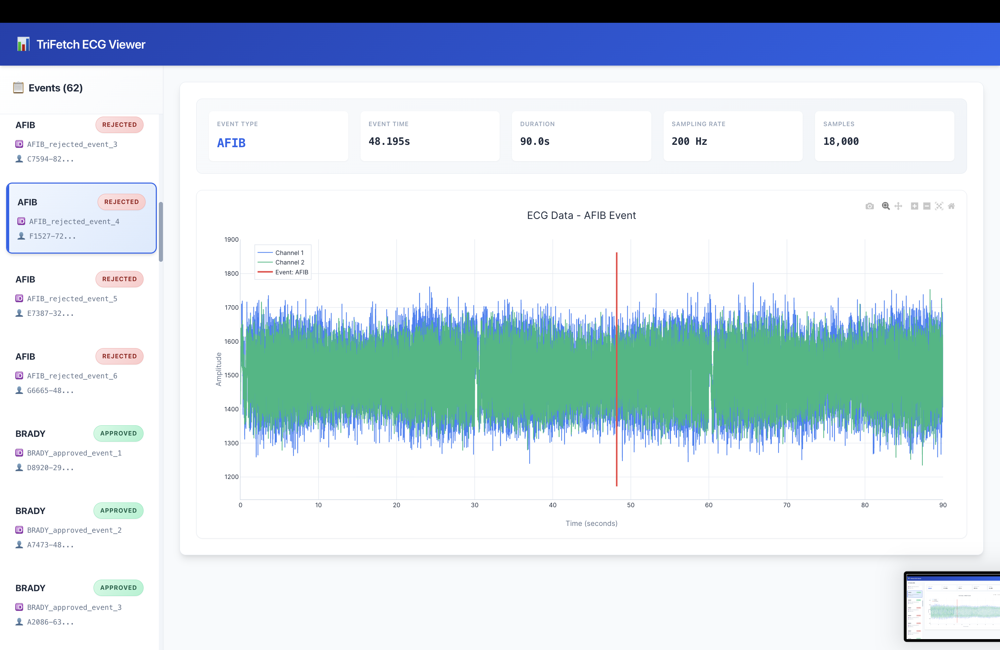
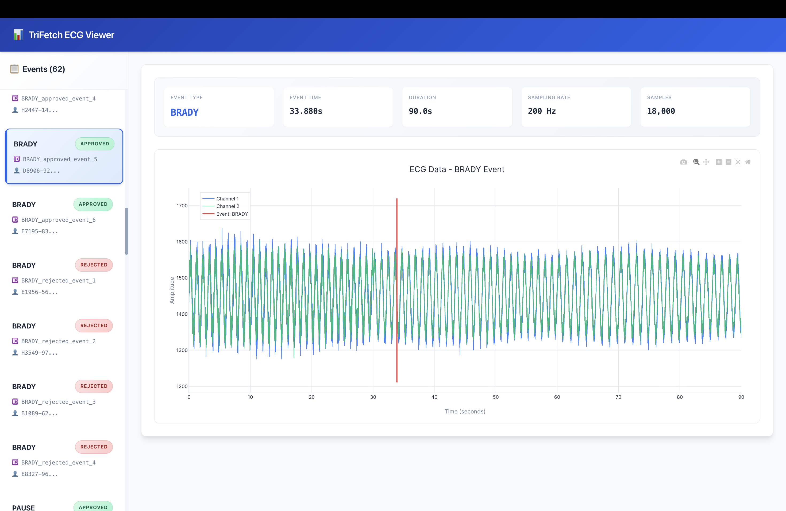
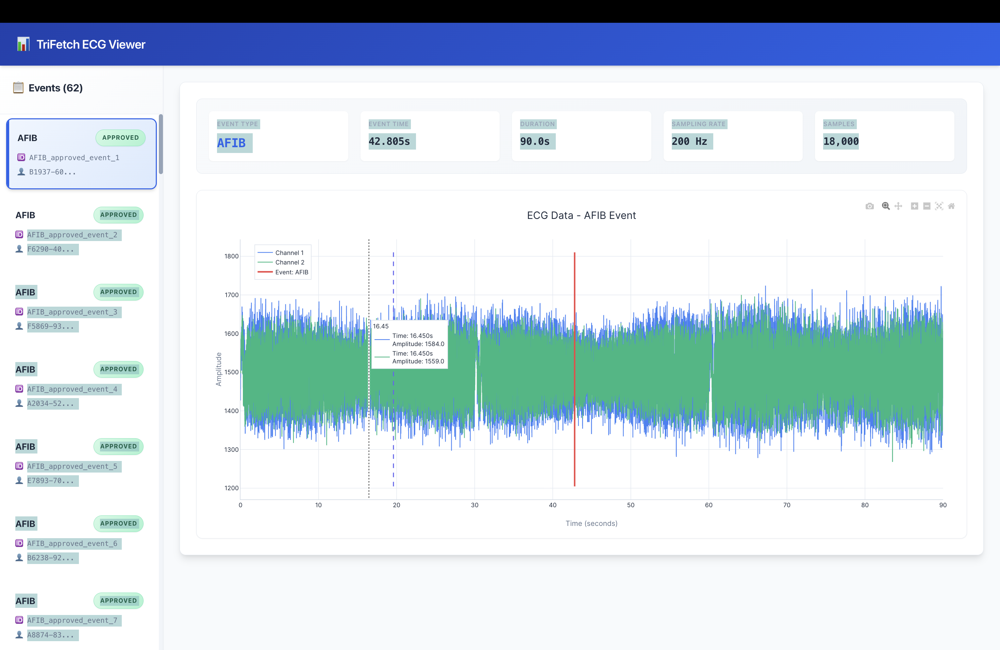

# ECG Classification System

A full-stack application for visualizing and classifying ECG arrhythmia events. The system loads ECG data from files, displays interactive plots with event markers, and can classify new ECG signals using a trained machine learning model.

## What This Does

The application reads ECG data files organized by event type (AFIB, VTACH, BRADY, etc.) and displays them in an interactive web interface. You can browse events, view their ECG waveforms, and see where the arrhythmia event occurred. There's also a prediction endpoint that can classify new ECG signals.

## Project Structure

```
├── backend/
│   ├── app/
│   │   ├── api/          # REST API endpoints
│   │   ├── data/         # Data loading and caching
│   │   ├── ml/           # ML models, feature extraction, event detection
│   │   ├── models/       # Pydantic data models
│   │   ├── config.py     # Configuration settings
│   │   └── main.py       # FastAPI app entry point
│   ├── data/             # ECG dataset directory
│   ├── models/           # Trained model files
│   ├── requirements.txt
│   ├── Dockerfile
│   ├── train_model.py    # Script to train the classifier
│   └── run_server.py     # Server startup script
├── frontend/
│   ├── src/
│   │   ├── components/   # React components (EventList, ECGPlot)
│   │   ├── services/     # API client
│   │   ├── types.ts      # TypeScript type definitions
│   │   └── App.tsx       # Main application component
│   ├── Dockerfile
│   └── package.json
├── docker-compose.yml
└── README.md
```

## How It Works

### Data Flow

1. **Data Loading**: On startup, the backend scans `backend/data/` for event folders. Each event folder contains:
   - A JSON metadata file (`event_N.json`) with patient ID, event type, timestamp, and approval status
   - One or more CSV files (`chunk1.txt`, `chunk2.txt`, etc.) with ECG channel data

2. **Event Processing**: The `DataLoader` reads each event's metadata and combines all chunk files into a single continuous ECG signal. It calculates where in the signal the event occurred based on the timestamp.

3. **Caching**: Events are cached in memory by `DataRepository` to avoid re-reading files on every request.

4. **Frontend Display**: When you open the app, it fetches the event list and displays them in a sidebar. Clicking an event loads its full ECG data and renders it with Plotly.js, showing both channels and marking the event location with a red vertical line.

### Model Training Flow

1. Load all events from the data directory
2. Extract features from each event's ECG data (statistical features like mean, std, percentiles, frequency domain features)
3. Train a Random Forest classifier on the extracted features
4. Save the trained model to `backend/models/ecg_classifier.pkl`

### Prediction Flow

1. Client sends raw ECG data (ch1 and ch2 arrays) to `/api/predict`
2. Backend extracts the same features used during training
3. Classifier predicts the event type and confidence
4. Event detector finds where in the signal the anomaly likely starts
5. Returns prediction, confidence, and event location

## Setup

### Prerequisites

- Docker and Docker Compose installed
- Or Python 3.9+ and Node.js 18+ for local development

### Quick Start with Docker

```bash
# Build and start both services
docker-compose build
docker-compose up -d

# Train the model (after adding data)
docker-compose exec backend python train_model.py

# View logs
docker-compose logs -f

# Stop services
docker-compose down
```

The frontend will be at http://localhost:3000 and the API at http://localhost:8000.

### Data Format

Place your ECG dataset in `backend/data/` with this structure:

```
backend/data/
├── AFIB_approved/
│   ├── event_1/
│   │   ├── event_1.json
│   │   ├── chunk1.txt
│   │   ├── chunk2.txt
│   │   └── chunk3.txt
│   └── event_2/
│       └── ...
├── VTACH_rejected/
│   └── ...
└── ...
```

**JSON Metadata Format** (`event_N.json`):
```json
{
  "Patient_IR_ID": "172A46BA-64B9-4A77-AAFA-F674C1B362AF",
  "EventOccuredTime": "2025-11-04 16:41:23.440",
  "Event_Name": "AFIB",
  "IsRejected": "0"
}
```

**ECG Data Format** (`chunk*.txt` - CSV with header):
```
ch1,ch2
1514,11
1516,42
1519,52
...
```

### Local Development

**Backend:**
```bash
cd backend
python -m venv venv
source venv/bin/activate  # Windows: venv\Scripts\activate
pip install -r requirements.txt
python train_model.py
python run_server.py
```

**Frontend:**
```bash
cd frontend
npm install
npm run dev
```

## API Endpoints

### GET /api/events

Returns a list of all available events.

**Response:**
```json
[
  {
    "event_id": "AFIB_approved_event_1",
    "event_type": "AFIB",
    "is_approved": true,
    "patient_id": "172A46BA-64B9-4A77-AAFA-F674C1B362AF"
  },
  ...
]
```

**Response Model:** `List[EventListResponse]`

### GET /api/events/{event_id}

Returns the full ECG data and metadata for a specific event.

**Path Parameters:**
- `event_id` (string): The event identifier (e.g., "AFIB_approved_event_1")

**Response:**
```json
{
  "event_id": "AFIB_approved_event_1",
  "metadata": {
    "patient_id": "172A46BA-64B9-4A77-AAFA-F674C1B362AF",
    "event_type": "AFIB",
    "event_time": "2025-11-04 16:41:23.440",
    "is_approved": true
  },
  "ecg_data": {
    "ch1": [1514, 1516, 1519, ...],
    "ch2": [11, 42, 52, ...],
    "sampling_rate": 200
  },
  "event_sample_index": 6000,
  "event_time_offset": 30.0
}
```

**Errors:**
- `404`: Event not found

### POST /api/predict

Classifies a new ECG signal and detects where the event occurs.

**Request Body:**
```json
{
  "ch1": [1514, 1516, 1519, ...],
  "ch2": [11, 42, 52, ...]
}
```

**Request Model:** `PredictionRequest`
- `ch1` (List[float]): ECG channel 1 data
- `ch2` (List[float]): ECG channel 2 data

**Response:**
```json
{
  "event_type": "AFIB",
  "confidence": 0.95,
  "event_sample_index": 6000,
  "event_time_offset": 30.0
}
```

**Response Model:** `PredictionResponse`
- `event_type` (string): Predicted arrhythmia type
- `confidence` (float): Prediction confidence (0-1)
- `event_sample_index` (int): Sample index where event detected
- `event_time_offset` (float): Time offset in seconds where event detected

**Errors:**
- `503`: Model not trained (need to run `train_model.py` first)

### GET /api/health

Health check endpoint.

**Response:**
```json
{
  "status": "healthy"
}
```

### GET /

Root endpoint.

**Response:**
```json
{
  "message": "ECG Classification API"
}
```

## Architecture Design

### System Architecture

```
┌─────────────────────────────────────────────────────────────────────────────┐
│                              FRONTEND                                       │
│                                                                             │
│  ┌──────────────┐     ┌──────────────┐      ┌──────────────┐                │
│  │   App.tsx   │─────▶│  EventList   │─────▶│   ECGPlot    │                │
│  │  (React)    │      │  Component   │      │  Component   │                │
│  └──────┬──────┘      └──────────────┘      └──────────────┘                │
│         │                                                                   │
│         │ HTTP/REST                                                         │
│         │ (Port 3000)                                                       │
│         ▼                                                                   │
└─────────┼───────────────────────────────────────────────────────────────────┘
          │
          │
┌─────────▼───────────────────────────────────────────────────────────────┐
│                              BACKEND API                                │
│                                                                         │
│  ┌──────────────────────────────────────────────────────────────────┐   │
│  │                        FastAPI Server                            │   │
│  │  ┌──────────────┐  ┌──────────────┐  ┌──────────────┐            │   │
│  │  │ GET /events  │  │ GET /events/ │  │ POST /predict│            │   │
│  │  │              │  │    {id}      │   │             │            │   │
│  │  └──────┬───────┘  └──────┬───────┘  └──────┬───────┘            │   │
│  └─────────┼─────────────────┼─────────────────┼────────────────────┘   │
│            │                 │                 │                        │
│            ▼                 ▼                 ▼                        │
│  ┌──────────────┐  ┌──────────────┐  ┌──────────────┐                   │
│  │DataRepository│  │FeatureExtract│  │ECGClassifier │                   │
│  │  (Cache)     │  │ (24 features)│  │(Random Forest│                   │
│  └──────┬───────┘  └──────┬───────┘  └──────┬───────┘                   │ 
│         │                 │                 │                           │
│         ▼                 │                 │                           │
│  ┌──────────────┐         │                 │                           │
│  │  DataLoader  │         │                 │                           │
│  │  (File I/O)  │         │                 │                           │
│  └──────┬───────┘         │                 │                           │
│         │                 │                 │                           │
│         └─────────────────┴─────────────────┘                           │
│                           │                                             │
└───────────────────────────┼─────────────────────────────────────────────┘
                            │
                            ▼
┌────────────────────────────────────────────────────────────────────────────┐
│                              DATA LAYER                                    │
│                                                                            │
│  ┌──────────────────────┐        ┌──────────────────────┐                  │
│  │   ECG Data Files     │        │   Trained Models     │                  │
│  │   backend/data/      │        │   backend/models/    │                  │
│  │   • event_N.json     │        │   • *.pkl            │                  │
│  │   • chunk*.txt       │        │                      │                  │
│  └──────────────────────┘        └──────────────────────┘                  │
└────────────────────────────────────────────────────────────────────────────┘
```

### System Flow

**Event Loading Flow:**
```
User → Frontend → API Request → DataRepository → DataLoader → File System → Response → Frontend → User
```

**Prediction Flow:**
```
User → Frontend → API Request → FeatureExtractor → ECGClassifier → EventDetector → Response → Frontend → User
```

**Training Flow:**
```
DataLoader → FeatureExtractor → ModelTrainer → ECGClassifier → Model Storage
```

### Component Architecture

#### Backend Architecture

**1. API Layer (`app/api/routes.py`)**
- **Purpose**: RESTful endpoint definitions and request/response handling
- **Responsibilities**: 
  - Route HTTP requests to appropriate handlers
  - Validate input using Pydantic models
  - Handle errors and return appropriate HTTP status codes
  - Dependency injection for services (classifier, data repository)

**2. Data Layer (`app/data/`)**
- **DataLoader**: File I/O operations, parsing JSON metadata and CSV ECG chunks
- **DataRepository**: In-memory caching layer, provides fast access to loaded events
- **Design Pattern**: Repository pattern for data access abstraction

**3. ML Layer (`app/ml/`)**
- **FeatureExtractor**: Extracts 24 features (12 per channel) from raw ECG signals
- **ECGClassifier**: Random Forest implementation with interface abstraction
- **ModelTrainer**: Orchestrates training pipeline (load data → extract features → train → save)
- **EventDetector**: Window-based anomaly detection for locating events in signals

**4. Models Layer (`app/models/`)**
- Pydantic models for type-safe data validation
- Ensures data consistency across API boundaries

#### Frontend Architecture

**1. Component Hierarchy**
```
App.tsx (Container Component)
├── EventList (Presentation Component)
│   └── EventItem (Sub-component)
└── ECGPlot (Presentation Component)
    └── Plotly Chart (Third-party)
```

**2. State Management**
- **Local State**: React hooks (`useState`, `useEffect`, `useMemo`)
- **Data Fetching**: Custom hooks pattern with Axios
- **Caching**: Browser-level caching via React component lifecycle

**3. Service Layer**
- **API Service**: Centralized HTTP client with error handling and interceptors
- **Type Safety**: TypeScript interfaces for all API contracts

### Data Flow Architecture

**1. Event Loading Flow**
```
File System → DataLoader → DataRepository (Cache) → API Route → JSON Response → Frontend
```

**2. Prediction Flow**
```
Frontend Request → API Route → FeatureExtractor → ECGClassifier → EventDetector → JSON Response
```

**3. Training Flow**
```
DataLoader → FeatureExtractor → ModelTrainer → ECGClassifier.train() → Model Serialization
```

### Design Patterns Used

1. **Repository Pattern**: `DataRepository` abstracts data access
2. **Dependency Injection**: FastAPI's dependency system for loose coupling
3. **Interface Segregation**: `IClassifier` and `IEventDetector` interfaces
4. **Strategy Pattern**: Swappable classifier implementations
5. **Factory Pattern**: Model loading and initialization
6. **Singleton Pattern**: Shared data repository instance

## Technical Choices and Reasoning

### Backend Technology Stack

#### FastAPI Framework

**Choice**: FastAPI over Flask/Django

**Reasoning**:
1. **Performance**: Built on Starlette and Pydantic, offers async/await support for I/O-bound operations (file reading, model inference)
2. **Type Safety**: Automatic request/response validation using Pydantic models reduces runtime errors
3. **Developer Experience**: Auto-generated OpenAPI/Swagger documentation saves development time
4. **Modern Python**: Native support for async/await, type hints, and modern Python features
5. **Production Ready**: Built-in support for dependency injection, middleware, and testing

**Trade-offs**:
- Slightly steeper learning curve than Flask
- Less mature ecosystem than Django (acceptable for this use case)

#### Random Forest Classifier

**Choice**: Random Forest over other ML algorithms

**Reasoning**:
1. **Non-linear Patterns**: ECG signals have complex, non-linear relationships that Random Forest handles well
2. **Feature Importance**: Provides interpretable feature importance scores for medical validation
3. **Robustness**: Handles missing values and outliers better than linear models
4. **Baseline Performance**: Excellent baseline for classification tasks without extensive hyperparameter tuning
5. **Training Speed**: Fast training compared to deep learning models (important for iteration)
6. **No Feature Scaling Required**: Works well with mixed feature scales (though we use StandardScaler for consistency)

**Trade-offs**:
- Less expressive than deep learning for complex temporal patterns
- May require more trees for very large datasets
- Memory usage grows with number of trees

**Alternative Considered**: 
- **CNN/LSTM**: Better for temporal patterns but requires more data, longer training, and GPU resources
- **SVM**: Good for small datasets but doesn't scale well and less interpretable
- **XGBoost**: Better performance but more hyperparameters to tune

#### Feature Engineering Approach

**Choice**: Hand-crafted features (24 features: 12 per channel)

**Feature Categories**:
1. **Statistical Features** (8 per channel):
   - Mean, Standard Deviation, Median
   - 25th and 75th Percentiles
   - Min, Max, Peak-to-Peak
   - Rationale: Capture amplitude distribution and signal variability

2. **Temporal Features** (2 per channel):
   - Mean absolute difference (captures signal smoothness)
   - Standard deviation of differences (captures variability in rate of change)
   - Rationale: ECG arrhythmias often manifest as changes in signal dynamics

3. **Frequency Domain Features** (2 per channel):
   - Low-frequency power (0-25% of spectrum)
   - Mid-frequency power (25-50% of spectrum)
   - Rationale: Different arrhythmias have distinct frequency signatures

**Reasoning**:
1. **Interpretability**: Medical professionals can understand what features contribute to predictions
2. **Data Efficiency**: Works well with limited training data (62 events)
3. **Domain Knowledge**: Incorporates medical signal processing principles
4. **Computational Efficiency**: Fast feature extraction (<100ms per signal)

**Trade-offs**:
- May miss complex temporal patterns that deep learning could capture
- Requires domain expertise to design effective features
- Fixed feature set may not adapt to new arrhythmia types

#### In-Memory Caching Strategy

**Choice**: In-memory caching in `DataRepository` instead of database

**Reasoning**:
1. **Performance**: Sub-second response times for event data (meets <8s requirement)
2. **Simplicity**: No database setup required, reduces deployment complexity
3. **Data Volume**: 62 events × ~18k samples each = manageable memory footprint (~50-100MB)
4. **Read-Heavy Workload**: Data is static after initial load, perfect for caching

**Trade-offs**:
- **Scalability**: Won't scale beyond ~1000 events without memory issues
- **Persistence**: Cache lost on server restart (acceptable for this use case)
- **Concurrency**: Single-threaded Python GIL limits concurrent reads (mitigated by async I/O)

**Future Improvement**: Redis for distributed caching if scaling needed

#### Event Detection Algorithm

**Choice**: Window-based statistical threshold detection

**Reasoning**:
1. **Simplicity**: Easy to understand and debug
2. **Fast**: O(n) complexity for signal of length n
3. **Robust**: Works across different event types
4. **Medical Relevance**: Based on signal amplitude and variability changes

**Algorithm**:
- Sliding window (200 samples = 1 second at 200Hz)
- Calculate mean and std deviation per window
- Detect windows where std exceeds threshold (2× baseline std)
- Mark first anomalous window as event location

**Trade-offs**:
- May miss subtle events that don't show clear statistical changes
- Threshold tuning required for different signal qualities
- Fixed window size may not match actual event duration

### Frontend Technology Stack

#### React + TypeScript

**Choice**: React with TypeScript over vanilla JavaScript or Vue

**Reasoning**:
1. **Type Safety**: Catches errors at compile time, especially important for API contracts
2. **Component Reusability**: Modular components (EventList, ECGPlot) easy to maintain
3. **Ecosystem**: Large ecosystem of libraries (Plotly, Axios)
4. **Industry Standard**: Widely used, good for team collaboration
5. **Developer Experience**: Excellent tooling (VSCode, React DevTools)

**Trade-offs**:
- Slightly more verbose than JavaScript
- Build step required (acceptable trade-off for type safety)

#### Plotly.js for Visualization

**Choice**: Plotly.js over D3.js, Chart.js, or Recharts

**Reasoning**:
1. **Performance**: Handles large datasets (18k+ samples) smoothly with WebGL rendering
2. **Interactivity**: Built-in zoom, pan, hover, and selection tools
3. **Medical-Grade**: Used in scientific/medical applications, supports precise time-series visualization
4. **Dual Channel Support**: Easy to overlay multiple traces (ch1, ch2, event marker)
5. **Responsive**: Automatic resizing and mobile support

**Trade-offs**:
- Larger bundle size (~3MB) than lighter alternatives
- More complex API than simpler charting libraries
- Overkill for simple charts (but necessary for ECG visualization)

**Alternatives Considered**:
- **D3.js**: More flexible but requires more code for common operations
- **Chart.js**: Lighter but struggles with 18k+ data points
- **Recharts**: React-native but less performant for large datasets

#### Vite Build Tool

**Choice**: Vite over Create React App or Webpack

**Reasoning**:
1. **Development Speed**: Near-instant HMR (Hot Module Replacement)
2. **Build Performance**: Faster production builds using esbuild
3. **Modern**: Native ES modules, better tree-shaking
4. **Proxy Support**: Easy API proxying for development

### Architecture Decisions

#### SOLID Principles Implementation

**Single Responsibility Principle (SRP)**:
- `DataLoader`: Only responsible for file I/O and parsing
- `DataRepository`: Only responsible for caching and retrieval
- `FeatureExtractor`: Only responsible for feature extraction
- `ECGClassifier`: Only responsible for classification
- `EventDetector`: Only responsible for event location detection

**Open/Closed Principle (OCP)**:
- `IClassifier` interface allows adding new classifier implementations without modifying existing code
- `IEventDetector` interface allows swapping detection algorithms

**Liskov Substitution Principle (LSP)**:
- Any `IClassifier` implementation can be substituted without breaking functionality

**Interface Segregation Principle (ISP)**:
- Small, focused interfaces (`IClassifier`, `IEventDetector`) instead of large monolithic interfaces

**Dependency Inversion Principle (DIP)**:
- High-level modules (routes) depend on abstractions (`IClassifier`) not concrete implementations
- FastAPI's dependency injection system enforces this

#### Error Handling Strategy

**Backend**:
- Try-except blocks with logging at service boundaries
- HTTP status codes: 404 for not found, 503 for service unavailable (model not loaded)
- Graceful degradation: Returns empty list if data loading fails

**Frontend**:
- Error boundaries for component-level error handling
- User-friendly error messages with retry buttons
- Loading states for better UX

#### Performance Optimizations

1. **In-Memory Caching**: Eliminates repeated file I/O
2. **Lazy Loading**: Events loaded on-demand, not all at once
3. **Memoization**: React `useMemo` for expensive computations (time axis, min/max Y)
4. **Async I/O**: FastAPI async endpoints for non-blocking operations
5. **Feature Extraction Optimization**: Vectorized NumPy operations

### Docker Architecture

**Choice**: Docker Compose for orchestration

**Reasoning**:
1. **Reproducibility**: Same environment across development and production
2. **Isolation**: Frontend and backend in separate containers
3. **Easy Deployment**: Single `docker-compose up` command
4. **Volume Mounts**: Persistent data and model storage
5. **Health Checks**: Automatic container health monitoring

**Container Strategy**:
- **Backend**: Python 3.9-slim base image, multi-stage build for optimization
- **Frontend**: Node 18-alpine for smaller image size, Vite dev server for development
- **Networking**: Docker bridge network for service communication
- **Volumes**: Persistent storage for data and trained models

## Future Improvements

### Model Improvements

1. **Deep Learning Models**
   - **CNN (Convolutional Neural Networks)**: Learn spatial patterns in ECG signals automatically
   - **LSTM/GRU**: Capture temporal dependencies and long-term patterns in arrhythmia sequences
   - **Hybrid CNN-LSTM**: Combine spatial feature learning with temporal modeling
   - **Transfer Learning**: Pre-train on large public ECG datasets (MIT-BIH, PhysioNet)
   - **Expected Impact**: 10-15% accuracy improvement, better generalization to new event types

2. **Advanced Feature Engineering**
   - **Wavelet Transform Features**: Multi-resolution analysis for detecting events at different time scales
   - **Heart Rate Variability (HRV) Features**: R-R interval analysis for arrhythmia detection
   - **Morphological Features**: QRS complex detection and analysis
   - **Cross-Channel Features**: Relationships between ch1 and ch2 signals

3. **Ensemble Methods**
   - Combine Random Forest with XGBoost and Neural Networks
   - Voting or stacking for improved robustness
   - Expected 5-8% accuracy boost

4. **Model Interpretability**
   - SHAP (SHapley Additive exPlanations) values for feature importance
   - LIME (Local Interpretable Model-agnostic Explanations) for individual predictions
   - Critical for medical acceptance and regulatory approval

### Infrastructure Improvements

1. **Database Storage**
   - **PostgreSQL** with TimescaleDB extension for time-series ECG data
   - **Benefits**: Faster queries, indexing, concurrent access, data persistence
   - **Migration Path**: Replace `DataRepository` with database queries, keep caching layer

2. **Real-time Streaming**
   - WebSocket support for live ECG monitoring
   - Streaming feature extraction and prediction
   - Useful for continuous patient monitoring scenarios

3. **Caching Strategy**
   - **Redis** for distributed caching
   - **CDN** for static frontend assets
   - **Query Result Caching**: Cache frequent API responses

4. **Model Versioning and A/B Testing**
   - Model registry (MLflow, DVC)
   - A/B testing framework for comparing model versions
   - Gradual rollout of new models

### UI/UX Improvements

1. **Advanced Filtering and Search**
   - Filter by event type, date range, patient ID
   - Full-text search across metadata
   - Saved filter presets

2. **Export Functionality**
   - Export ECG plots as PNG/PDF
   - Export event data as CSV/JSON
   - Batch export for multiple events

3. **Comparison View**
   - Side-by-side comparison of multiple events
   - Overlay different events on same plot
   - Statistical comparison panel

4. **Annotations and Notes**
   - User annotations on ECG plots
   - Clinical notes per event
   - Collaboration features

5. **Mobile Responsiveness**
   - Optimized mobile layout
   - Touch gestures for plot interaction
   - Progressive Web App (PWA) support

### Performance Optimizations

1. **Frontend Optimizations**
   - Code splitting and lazy loading
   - Virtual scrolling for large event lists
   - Web Workers for heavy computations (feature extraction in browser)

2. **Backend Optimizations**
   - Connection pooling for database
   - Async batch processing for bulk operations
   - GraphQL API for flexible data fetching

3. **ML Pipeline Optimizations**
   - Feature caching to avoid recomputation
   - Model quantization for faster inference
   - GPU acceleration for deep learning models

### Security and Compliance

1. **Authentication and Authorization**
   - JWT-based authentication
   - Role-based access control (RBAC)
   - Audit logging for medical data access

2. **Data Privacy**
   - Encryption at rest and in transit
   - HIPAA compliance measures
   - Patient data anonymization

3. **API Security**
   - Rate limiting
   - Input validation and sanitization
   - API key management

### Monitoring and Observability

1. **Logging and Metrics**
   - Structured logging (JSON format)
   - Application metrics (Prometheus)
   - Performance monitoring (APM)

2. **Error Tracking**
   - Sentry for error tracking
   - Alerting for critical failures
   - Error analytics dashboard

3. **Model Monitoring**
   - Prediction drift detection
   - Model performance tracking over time
   - Automated retraining triggers

## Screenshots

### Main Application View
The application interface displays a sidebar with 62 events and a main content area for ECG visualization. The header shows "ECG Viewer" and the layout is clean and modern.


*Full application view showing event list sidebar (left) with 62 events and ECG plot area (right) ready for event selection*

### Event List Sidebar
The sidebar displays all available events organized by type (AFIB, VTACH, BRADY, PAUSE, TACHY) with their approval status. Each event shows the event type, a status badge (green for approved, red for rejected), event ID, and patient ID.


*Scrollable event list showing multiple event types with approved (green) and rejected (red) status badges. Events are clickable to view their ECG data.*

### AFIB Event Visualization
AFIB (Atrial Fibrillation) event visualization showing irregular ECG patterns. The red vertical line marks the exact moment the event occurred.


*AFIB event ECG plot displaying both Channel 1 (blue) and Channel 2 (green) waveforms with prominent red event marker. The irregular patterns characteristic of atrial fibrillation are clearly visible.*

### Additional AFIB Event View
Another view of an AFIB event showing different ECG patterns and event marker placement.


*Alternative AFIB event visualization demonstrating the variability in atrial fibrillation patterns across different recordings.*

### VTACH Event with Event Marker
VTACH (Ventricular Tachycardia) event showing rapid ventricular rhythms. The event marker indicates the event occurrence.


*VTACH event visualization with red event marker. The plot shows rapid, regular ventricular rhythms typical of ventricular tachycardia across both channels.*

### BRADY Event with Event Marker
BRADY (Bradycardia) event displaying slower heart rate patterns. The event marker shows when the bradycardia event was detected.


*BRADY event plot with red event marker. The slower, more spaced-out heartbeats characteristic of bradycardia are visible in both ECG channels.*

### Event Information Panel
The information panel displays key metrics for the selected event including event type, precise event time, recording duration, sampling rate, and total number of samples.


*Event details panel showing: Event Type, Event Time, Duration, Sampling Rate, and Total Samples. This information helps users understand the context of each ECG recording.*

### Multiple Event Types View
The sidebar demonstrates the application's ability to handle various arrhythmia types. Events are clearly categorized and color-coded by their approval status.


*Sidebar view showing different event types (AFIB, VTACH, BRADY, PAUSE, TACHY) with their respective status badges. The interface supports both approved and rejected events for comprehensive analysis.*

### API Documentation
FastAPI automatically generates interactive API documentation using Swagger UI, making it easy to test endpoints and understand request/response formats.


*Swagger UI interface showing all available API endpoints including GET /api/events, GET /api/events/{event_id}, POST /api/predict, and GET /api/health. Each endpoint includes detailed request/response schemas and can be tested directly from the browser.*

### Additional Application Views


*Application interface showing event selection and ECG visualization with interactive controls.*


*Another view of the application demonstrating the responsive layout and event browsing interface.*


*ECG plot visualization with zoom and pan capabilities, showing detailed waveform analysis.*


*Event list and ECG visualization interface with multiple events displayed in the sidebar.*


*Initial application view showing the event list and empty ECG plot area ready for event selection.*

## Future Improvements

- Deep learning models (CNN/LSTM) for better feature learning
- Database storage instead of file-based for faster queries
- Real-time streaming for large ECG files
- Advanced filtering and search in the UI
- Export functionality for plots
- Model versioning and A/B testing
